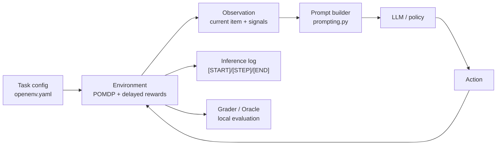

# RevLogiXenv: A Benchmark for Agentic Reasoning in Reverse Logistics

RevLogiXenv is an **OpenEnv-compatible benchmark** for reverse-logistics triage. It models return processing as a sequential decision problem with partial observability, fraud risk, delayed outcomes, and economic trade-offs.

Today, reverse logistics teams are forced to balance genuine returns, fraudulent returns, and ambiguous item states that are easy to misclassify. When those signals are wrong, the system loses economic value through unnecessary handling, chargebacks, failed recoveries, and poor disposition choices.

## The Core Challenge

Reverse logistics is not a simple classification task. The environment stresses five recurring failure modes:

1. Partial observability: the true condition of a returned item is hidden.
2. Adversarial behavior: fraudulent returns can resemble legitimate ones.
3. Temporal dynamics: actions can have delayed financial effects.
4. Economic asymmetry: false fraud flags and missed fraud have different costs.
5. Sequential complexity: agents must decide when to inspect, wait, or finalize a disposition.

## Benchmark Methodology

RevLogiXenv is designed as a **sequential triage** task and can be viewed as a **Partially Observable Markov Decision Process (POMDP)**.

* Belief state management: agents decide whether additional information is worth the cost of inspection.
* Temporal credit assignment: rewards can arrive after a delay, so earlier actions must be evaluated in context.
* Adversarial sensitivity: harder tasks introduce more ambiguous signals and stronger fraud mimicry.
* Scoring split: the benchmark table below uses the grader-mode score, while `inference.py` emits a separate inference-mode score from step rewards.

## Project Structure

```text
RevLogiXenv/
├── RevLogiXenv_v0/         # Core environment and logic
│   ├── environment.py      # POMDP dynamics and reward shaping
│   ├── models.py           # Schemas for actions, observations, and state
│   ├── prompting.py        # Prompt construction and parsing helpers
│   ├── grader.py           # Multi-metric evaluation
│   ├── oracle.py           # Reference policy and economics
│   ├── baseline.py         # LLM baseline implementation
│   └── policies.py         # Heuristic and deterministic baselines
├── server/                 # OpenEnv API layer
│   └── app.py              # FastAPI implementation
├── tests/                  # Robustness and scoring validations
├── openenv.yaml            # Benchmark manifest and task contract
├── inference.py            # Hackathon entrypoint
├── run_baseline.py         # Local benchmarking runner
└── Dockerfile              # Containerization for portable evaluation
```

## Benchmark Snapshot

The following table captures the benchmark results included with the project notes. MiniMax-M2.7 is intentionally kept as a smaller-model baseline; its lower result is a research finding that heuristic policies can outperform smaller LLMs on this task, while Gemini 2.5 Pro is the stronger featured comparator.

| Task | Heuristic | MiniMax-M2.7 | Gemini 2.5 Flash | Gemini 2.5 Pro |
|---|---:|---:|---:|---:|
| Easy | 0.946 | 0.770 | 0.876 | 0.959 |
| Medium | 0.690 | 0.536 | 0.842 | 0.931 |
| Hard | 0.395 | 0.359 | 0.621 | 0.783 |
| Overall | 0.677 | 0.555 | 0.780 | 0.891 |

### Behavioral Insight Snapshot

| Tier | Dominant Pattern | Critical Research Challenge |
|---|---|---|
| Easy | Fast resale / disposal | Maintaining zero-error rates in high-speed triage. |
| Medium | Diagnostic pivot with fraud checks | Managing false positive rates under moderate noise. |
| Hard | High-frequency fraud flagging | Preventing reward floor hits during diagnostic loops. |

### Technical Summary

| Tier | Total Steps | Avg Reward | Error Recovery | Behavioral Profile |
|---|---:|---:|---:|---|
| Easy | 22 | 0.71 | 1 wait | Optimized Fast-path |
| Medium | 36 | 0.54 | 2 waits | Diagnostic Pivot |
| Hard | 50 | 0.49 | 2 waits | High-Entropy Reactive |

## System Architecture



### Layered Implementation

1. Contract layer: `openenv.yaml` defines the task interface and scoring metadata.
2. Runtime layer: `RevLogiXenv_v0/environment.py` implements the POMDP dynamics, resolution queues, and reward shaping.
3. Policy layer: deterministic and LLM-based baselines are provided through `policies.py` and `baseline.py`.
4. Evaluation layer: `grader.py` and `oracle.py` provide margin and fraud metrics.
5. API layer: `server/app.py` exposes the OpenEnv-compatible FastAPI server.

## Getting Started

### 1. Installation

We recommend `uv` for reproducible dependency management.

```bash
# Install uv
powershell -c "irm https://astral.sh/uv/install.ps1 | iex"

# Synchronize environment
uv sync
```

*Alternatively, use standard pip:*

```bash
python -m venv .venv
.\.venv\Scripts\Activate.ps1
pip install -e ".[dev]"
```

### 2. Configuration

Copy the example environment file and provide your credentials.

```bash
Copy-Item .env.example .env
```

| Variable | Description |
|---|---|
| `HF_TOKEN` | Required for inference when using a hosted API. |
| `MODEL_NAME` | The LLM identifier to evaluate. |
| `API_BASE_URL` | Endpoint for the LLM API. |

### 3. Execution

#### Run Inference

```bash
uv run python inference.py
```

#### Run Local Baseline

```bash
uv run python run_baseline.py --mode local --tasks easy,medium,hard --pretty
```

#### Run LLM Evaluation

```bash
uv run python run_baseline.py --mode llm --provider auto --model gpt-4o-mini --tasks easy
```

## Docker Integration

### Build Image

```bash
docker build -t revlogixenv:latest .
```

### Run API Server

```bash
docker run --rm -p 8000:8000 -e PORT=8000 revlogixenv:latest
```

## Technical Validation

The environment is backed by a test suite that checks scoring consistency and contract alignment.

```bash
uv run pytest tests/
```

---
*Developed for the Meta OpenEnv Hackathon - Standardizing the future of Agentic AI Evaluation.*
