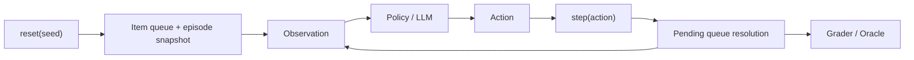

# Technical Specification: RevLogiXenv_v0 Core Internals

`RevLogiXenv_v0` is the core engine of the RevLogiXenv benchmark. It implements the environment runtime, decision-making policies, and evaluators used to exercise agentic reasoning in reverse-logistics scenarios.

## System Overview

The benchmark is organized around three pieces:

1. The contract: `openenv.yaml` defines actions, observations, tasks, and scoring.
2. The runtime: `environment.py` simulates the stochastic return-processing environment.
3. The evaluator: `grader.py` and `oracle.py` provide episode scoring and reference economics.

## Environment Model

RevLogiXenv is a **POMDP-style** environment with delayed financial resolution.

### Hidden State

Each item has a hidden condition such as:

- `perfect`
- `lightly_used`
- `damaged`
- `fraudulent`

### Observable Signals

The agent receives noisy signals including:

- condition score
- packaging condition
- damage flags
- optional inspection notes
- customer profile and fraud history

### Action Set

Actions exposed by the benchmark include:

- `resell_full`
- `resell_discount_15`
- `resell_discount_30`
- `resell_discount_50`
- `refurbish`
- `dispose`
- `flag_fraud`
- `inspect`
- `wait`

### Delayed Outcome Dynamics

Most actions enqueue a pending resolution, so reward may appear several steps after the decision that triggered it.

## Task Configurations

| Task | Items | Fraud | Noise | Delay |
|---|---:|---|---|---|
| `easy` | 20 | no | medium | fixed_3 |
| `medium` | 30 | yes | hard | variable |
| `hard` | 40 | yes | extra_hard | variable |
| `_legacy_easy` | 10 | no | easy | immediate |

Compatibility aliases `_old_easy`, `_old_medium`, and `_old_hard` are also supported.

## Scoring Details

### Inference Path

- Per-step reward is clamped to `[0.01, 0.99]`.
- The final output includes step logs and a final score field.
- Step logs are meant for validator consumption as well as debugging.
- Inference-mode score and grader-mode score are intentionally different: the first is for hackathon log validation, while the second is for local policy benchmarking.

### Grader Path

`Grader` returns:

- `profit`
- `optimal_profit`
- `margin_score`
- `fraud_metrics` (`precision`, `recall`, `f1`, plus counts)
- `final_score`

Task formulas:

1. `easy`: margin-based.
2. `medium`: margin-based.
3. `hard`: weighted margin + fraud F1.
4. `_legacy_easy`: compatibility path with the original easy behavior.

## Benchmark Visual



### Reference Snapshot

| Model | Easy | Medium | Hard | Overall |
|---|---:|---:|---:|---:|
| Heuristic | 0.946 | 0.690 | 0.395 | 0.677 |
| MiniMax-M2.7 | 0.770 | 0.536 | 0.359 | 0.555 |
| Gemini 2.5 Flash | 0.876 | 0.842 | 0.621 | 0.780 |
| Gemini 2.5 Pro | 0.959 | 0.931 | 0.783 | 0.891 |

## Public API Surface

Main exported interfaces:

- `AutonomousReturnsEnv`
- `ReturnsAction`, `ReturnsObservation`, `ReturnsState`
- `Grader`
- `Oracle`
- `HeuristicPolicy`
- `BaselineAgent`

## Example Usage

```python
from RevLogiXenv_v0 import AutonomousReturnsEnv, Grader
from RevLogiXenv_v0.models import ReturnsAction, DispositionAction

env = AutonomousReturnsEnv("medium")
obs = env.reset(seed=42)

while not obs.done:
    obs = env.step(ReturnsAction(action=DispositionAction.RESELL_DISCOUNT_30))

grader = Grader("medium")
result = grader.score_completed_episode(env=env)
print(result["final_score"])
```

## Test Coverage Focus

- Scoring consistency across paths
- Fraud metric edge cases
- Policy behavior regressions
- Incomplete episode guardrails
- Manifest/runtime contract checks
- Documentation clarity for operator onboarding

## Related Files

- `environment.py`: transition and reward logic
- `prompting.py`: shared prompt and parse utilities
- `grader.py`: policy evaluation metrics
- `oracle.py`: optimal reference policy/economics
- `baseline.py`: LLM baseline runner
- `policies.py`: deterministic heuristic baseline
